## МІНІСТЕРСТВО ОСВІТИ І НАУКИ УКРАЇНИ

## ХАРКІВСКИЙ НАЦІОНАЛЬНИЙ ЕКОНОМІЧНИЙ УНІВЕРСИТЕТ ІМЕНИ СЕМЕНА КУЗНЕЦЯ

# КАФЕДРА ІНФОРМАЦІЙНИХ СИСТЕМ

## Бак Роман
## Мої розв'язки
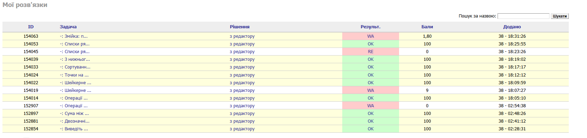
## Виведіть масив декілька разів
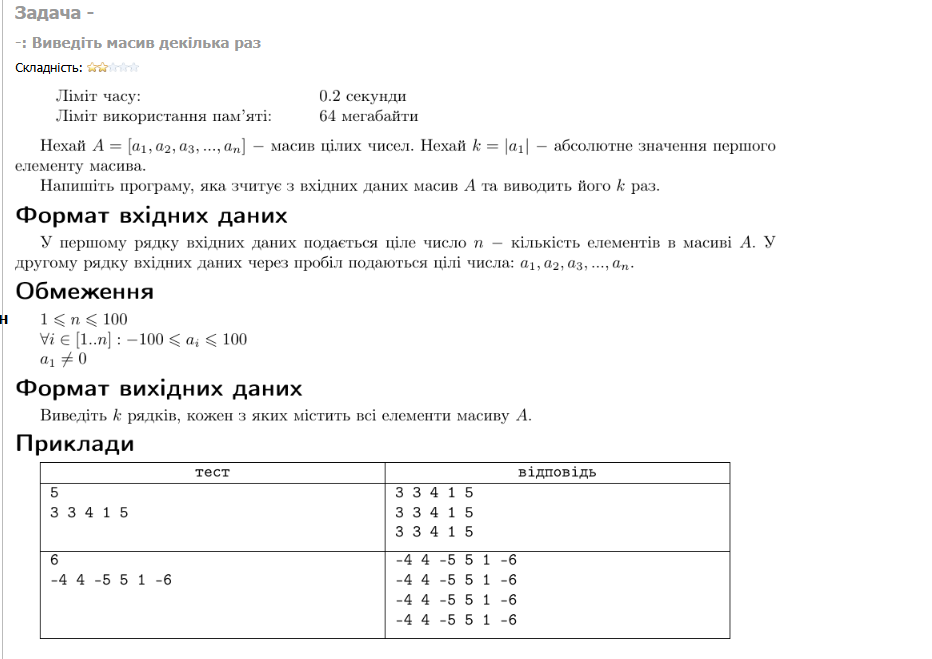
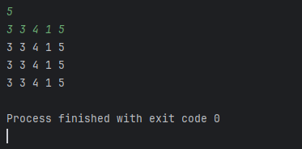
## Двозначні та чотиризначні
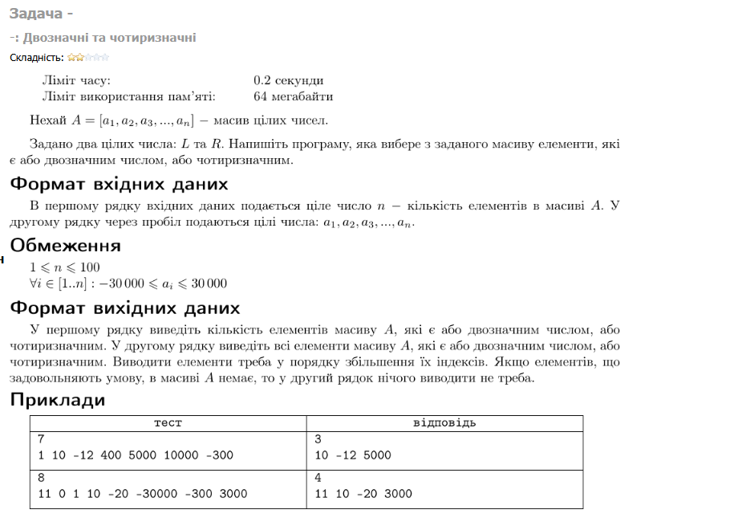
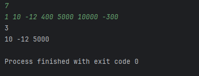
## 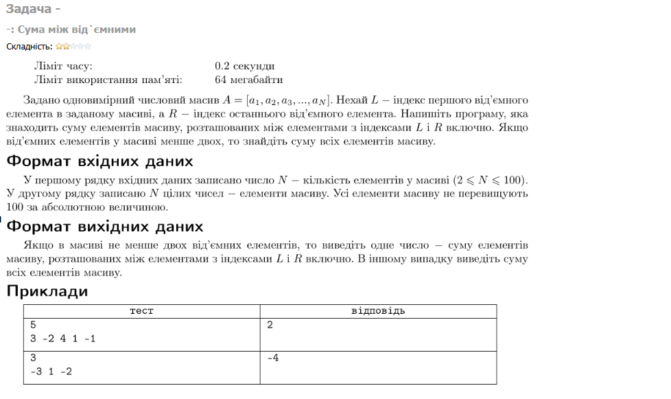
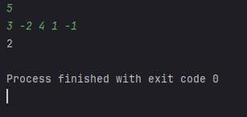
## Операції з масивом: delete, insert, swap
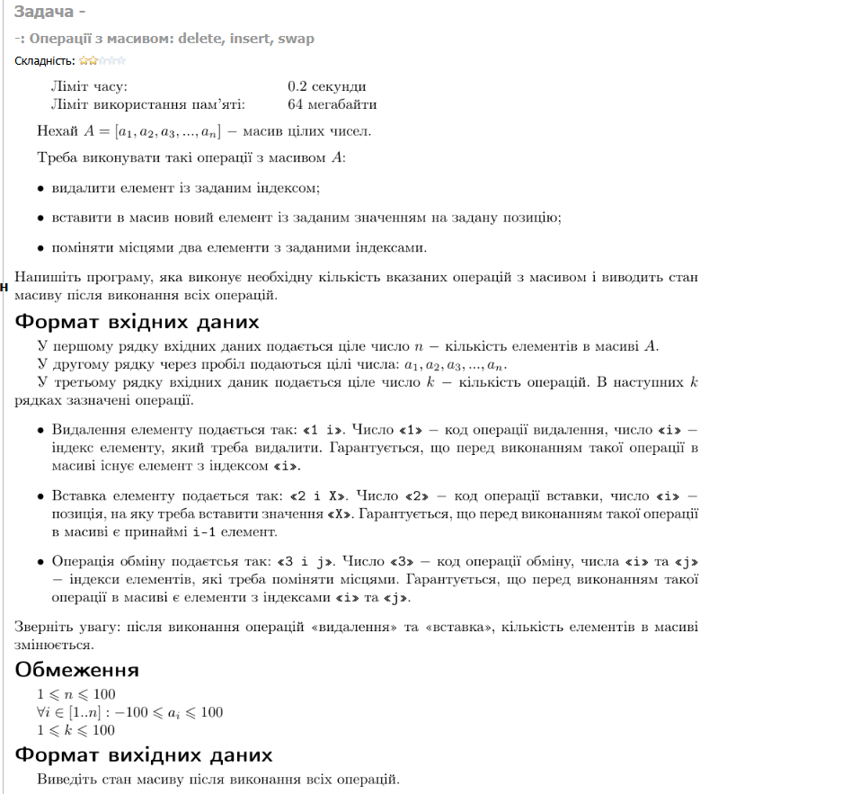
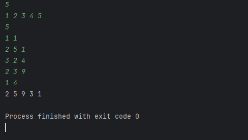
## Шейкерне сортувaння
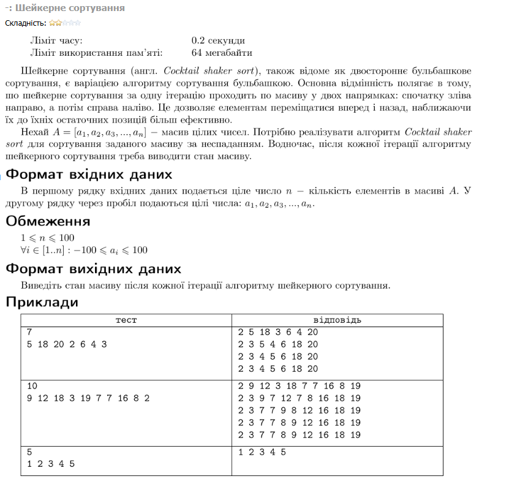
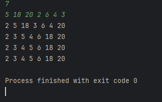
## Точки на числовій прямій
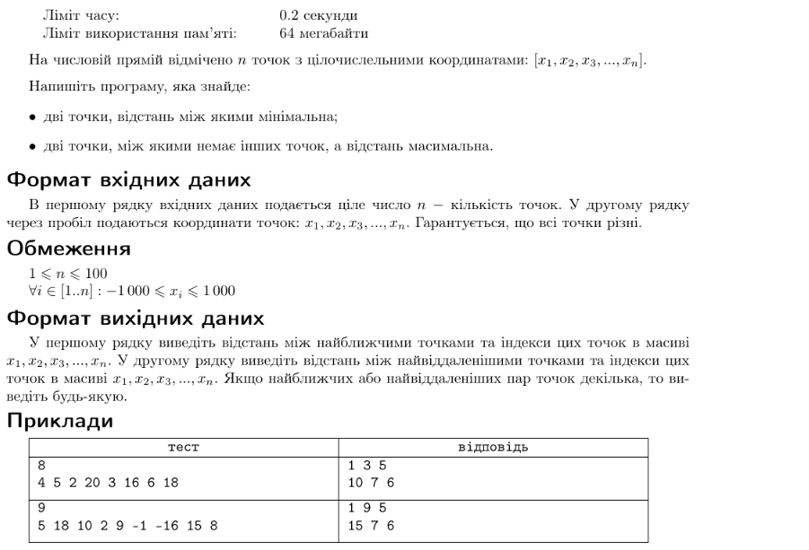

## Сортування додатних та від`ємних елементів
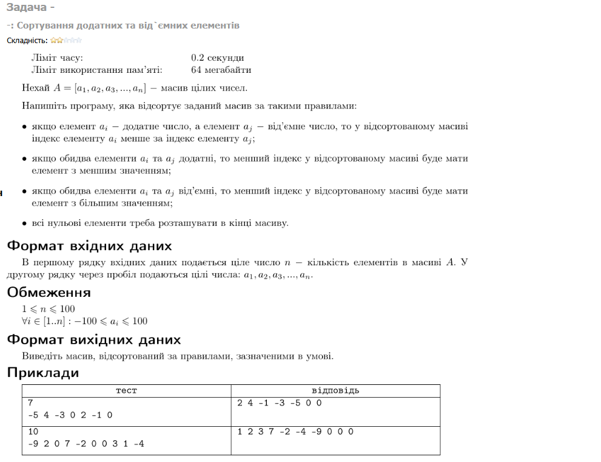
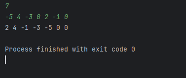
## З нижнього у верхній і навпаки
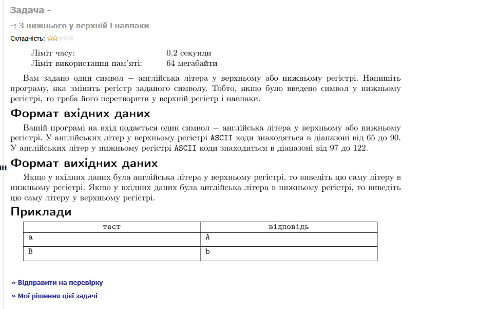
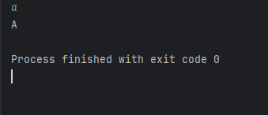
## Списки рядків та стовпчиків
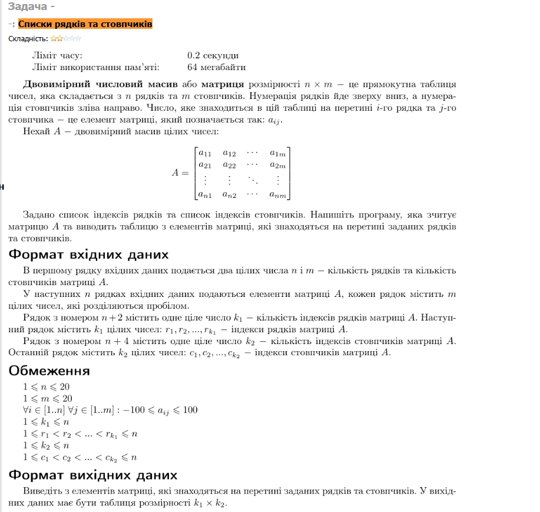
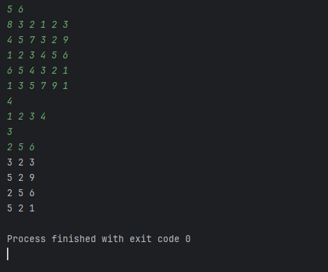
## 
	Задача	Рішення	Результ.	Бали	Додано
154063	-: Змійка: п...	з редактору	WA	1,80	38 - 18:31:26