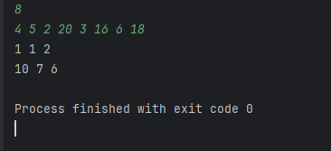
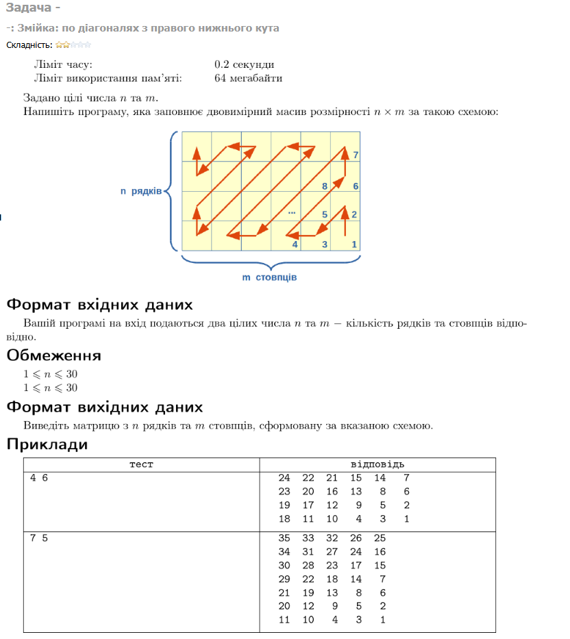

## МІНІСТЕРСТВО ОСВІТИ І НАУКИ УКРАЇНИ

## ХАРКІВСКИЙ НАЦІОНАЛЬНИЙ ЕКОНОМІЧНИЙ УНІВЕРСИТЕТ ІМЕНИ СЕМЕНА КУЗНЕЦЯ

# КАФЕДРА ІНФОРМАЦІЙНИХ СИСТЕМ

## Бак Роман
## Мої розв'язки

## Виведіть масив декілька разів

## Двозначні та чотиризначні

## 

## Операції з масивом: delete, insert, swap

## Шейкерне сортувaння

## Точки на числовій прямій

## Сортування додатних та від`ємних елементів

## З нижнього у верхній і навпаки

## Списки рядків та стовпчиків

## 
	Задача	Рішення	Результ.	Бали	Додано
154063	-: Змійка: п...	з редактору	WA	1,80	38 - 18:31:26